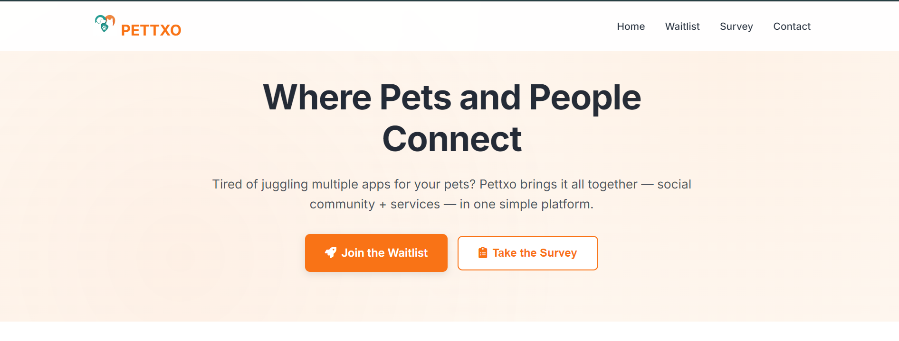

<<<<<<< HEAD
# 🐾 Pettxo Website

**Where Pets and People Connect**

A modern, responsive landing page for Pettxo - the world's first social + services platform for pets and their parents.



## 🌟 Features

### Design & User Experience

- **Modern, Pet-Friendly Design**: Warm color palette with soft blues, greens, and warm oranges
- **Responsive Layout**: Mobile-first design that works perfectly on all devices
- **Smooth Animations**: Subtle fade-ins, hover effects, and interactive elements
- **Accessibility Compliant**: WCAG guidelines followed with proper focus states and screen reader support

### Interactive Elements

- **Mobile Navigation**: Hamburger menu with smooth transitions
- **Waitlist Form**: Email validation and submission handling
- **Survey Modal**: Embedded Google Forms integration
- **Smooth Scrolling**: Between sections with proper header offset
- **Pet Easter Eggs**: Konami code activation and click paw prints

### Performance & SEO

- **Fast Loading**: Optimized assets and efficient code structure
- **SEO Optimized**: Proper meta tags, Open Graph, and semantic HTML
- **Progressive Enhancement**: Works without JavaScript, enhanced with it

## 🚀 Quick Start

### Prerequisites

- A modern web browser
- A local web server (optional, for development)

### Installation

1. **Clone or Download** the project files
2. **Open** `index.html` in your web browser
3. **Enjoy** the Pettxo experience!

### For Development

If you want to run a local server for development:

```bash
# Using Python 3
python -m http.server 8000

# Using Node.js (if you have http-server installed)
npx http-server

# Using PHP
php -S localhost:8000
```

Then visit `http://localhost:8000` in your browser.

## 📁 Project Structure

```
pettxo-website/
├── index.html          # Main HTML file
├── styles.css          # All CSS styles and animations
├── script.js           # JavaScript functionality
├── README.md           # This file
└── assets/             # Images and other assets (to be added)
    └── favicon.svg     # Website favicon
```

## 🎨 Design System

### Color Palette

- **Primary Blue**: `#4A90E2` - Trust and reliability
- **Secondary Orange**: `#F39C12` - Warmth and energy
- **Accent Green**: `#27AE60` - Growth and nature
- **Text Primary**: `#2C3E50` - Readable dark text
- **Background**: `#F8F9FA` - Clean, light background

### Typography

- **Headings**: Poppins (600 weight)
- **Body Text**: Inter (400 weight)
- **Responsive**: Font sizes scale with viewport

### Components

- **Buttons**: Rounded, with hover effects and gradients
- **Forms**: Floating labels with smooth animations
- **Cards**: Subtle shadows and rounded corners
- **Navigation**: Fixed header with backdrop blur

## 🔧 Customization

### Colors

Edit the CSS custom properties in `styles.css`:

```css
:root {
  --primary-color: #4a90e2;
  --secondary-color: #f39c12;
  --accent-color: #27ae60;
  /* ... other colors */
}
```

### Content

Update the content in `index.html`:

- Hero section text and CTAs
- Waitlist form fields
- Survey integration URL
- Contact information

### Survey Integration

Replace the Google Forms URL in the modal:

```html
<iframe
  src="https://docs.google.com/forms/d/e/YOUR_FORM_ID/viewform?embedded=true"
  ...
></iframe>
```

## 🎯 Key Sections

### 1. Hero Section

- Compelling tagline: "Where Pets and People Connect"
- Clear value proposition
- Dual CTAs: Waitlist and Survey
- Animated pet illustration

### 2. Problem & Solution

- Clear explanation of current pet care challenges
- Pettxo's comprehensive solution
- Visual problem/solution cards

### 3. Waitlist Signup

- Simple, engaging form
- Email validation
- Success notifications
- Pet type selection

### 4. Survey Integration

- Modal popup for survey
- Google Forms integration
- Easy access from multiple locations

### 5. Mission & Vision

- Company mission statement
- Visual ecosystem illustration
- Animated pet orbit

## 🎮 Easter Eggs

The website includes several fun interactive elements:

1. **Konami Code**: Press `↑↑↓↓←→←→BA` for a pet party animation
2. **Paw Prints**: Click anywhere to leave temporary paw prints
3. **Console Message**: Check the browser console for a welcome message
4. **Pet Sounds**: Subtle audio feedback on interactions

## 📱 Responsive Design

The website is fully responsive with breakpoints at:

- **Desktop**: 1200px+ (full layout)
- **Tablet**: 768px-1199px (adjusted grid layouts)
- **Mobile**: <768px (stacked layout, mobile menu)

## ♿ Accessibility Features

- **Keyboard Navigation**: All interactive elements are keyboard accessible
- **Screen Reader Support**: Proper ARIA labels and semantic HTML
- **Focus Management**: Clear focus indicators
- **Reduced Motion**: Respects user's motion preferences
- **High Contrast**: Supports high contrast mode

## 🚀 Performance Optimizations

- **CSS Grid & Flexbox**: Modern layout techniques
- **Intersection Observer**: Efficient scroll animations
- **Debounced Events**: Optimized scroll handling
- **Minimal Dependencies**: Only Font Awesome for icons
- **Optimized Images**: WebP format support (when added)

## 🔮 Future Enhancements

Potential additions for future versions:

- **Blog Section**: Content marketing platform
- **Testimonials**: User feedback and social proof
- **Pet Gallery**: User-submitted pet photos
- **Service Provider Directory**: Preview of marketplace
- **Multi-language Support**: International expansion
- **Dark Mode**: User preference toggle

## 📞 Contact & Support

- **Email**: officialpettxo@gmail.com
- **Instagram**: @pettxo
- **Website**: [pettxo.com](https://pettxo.com)

## 📄 License

© 2025 Pettxo. All rights reserved.

---

**Built with ❤️ for pets and their parents everywhere! 🐕🐱🦜**
=======
# Pettxo_LandingPage
>>>>>>> aedcc47f1a297aee39a3e657536d25fa5f914340
